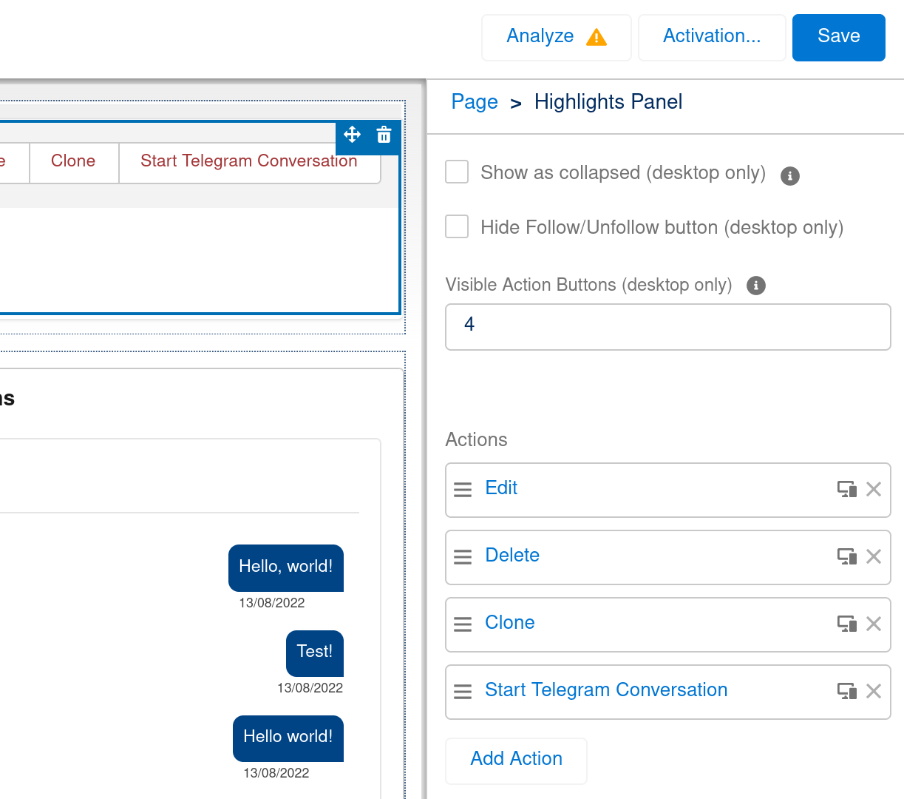

# Message Bird App

## Notice

This source code is result of an assignment to the selection process for a senior Salesforce engineer position within Message Bird.

## Installation Instructions

To install this package in a sandbox or developer edition environment, deploy the contents of this repository.

## Setup Instructions

Below is a short list of the steps necessary to see the application working. More details are provided below.

1. Install the package, as explained in the "Installation Instructions" section above.
2. Set up the Named Credential so Salesforce can connect with Message Bird's API.
3. Assign to yourself the permission set to gain access to the package's metadata.
4. Create a "Channel" record with the ID from Message Bird's UI.
5. Create a "start conversation" screen flow from the template provided by the app, and add it to the contact screen page.
6. Navigate to a contact record page and click "start conversation", then refresh the page and see the component working.

### 1. Set up the named credential

On setup, search for "named credentials" on the search menu on the left. Click "New" to create a new entry. The named credential should have **exactly** the values below in the specified fields:

| Attribute               | Value                                                                                               |
| ----------------------- | --------------------------------------------------------------------------------------------------- |
| Name                    | `MessageBird`                                                                                       |
| URL                     | https://conversations.messagebird.com                                                               |
| Identity Type           | Named Principal                                                                                     |
| Authentication Protocol | Password Authentication                                                                             |
| Password                | <the Live API key from your Message Bird account, found in the Dashboard > Developers > API Access> |

Note: the Test API key does not work.

### 2. Assign the permission set

When the app is installed in the environment, you'll see a "Message Bird" permission set. This permission set grants access to the necessary classes, app, objects and fields to use. Assign it to your users by searching for "Permission Sets" on setup, and then on "Manage Assignments" on the permission set page.

### 3. Create a channel

Now that you have assigned the permission set to your user, click on the application menu on the top left corner of your Lightning Experience screen, and select "Message Bird manager" to go to the app you just installed. The first tab you'll see will be the "Channels" tab, which contains the available channels your org can connect to.

Create a new record by clicking "New" and give it a meaningful name (such as the name of the application you are connecting with, such as "Telegram"). The "Identifier" field is the channel identifier found in your Message Bird account. If you have not yet crated a Telegram channel, do so and come back to this guide. Once you have created the Telegram channel on Message Bird, copy its channel identifier and paste onto this record. Set its "Active" checkbox to checked and save.

### 4. Create a start conversation flow

The package comes with a "start conversation" template flow for you. On Setup go to your "Flows" menu under "Process Automation", and from there click on "New Flow". On the Flow Builder interface, switch the tab from "Core" to "All + Templates":

Scroll to the bottom of the page and select the "Start Conversation (Template)" template. Once it opens up, hit "Save" on the top right and give it the name of "Start Conversation" or something similar (it doesn't matter for the app). Set it to active too.

Access your contact page with the App Builder by going to the Object Manager tab on Setup, then clicking on the "Contact" object.

Create a quick action first that invokes the screen flow by clicking on "New Action" in the "Buttons, Links and Actions" section of this object. The quick action's "Action Type" should be "Flow" and the Flow being used should be the "start conversation" flow you created before (do not select the template, because templates do not work). Give it a meaningful label, such as "start convo", and save.

Now navigate to the "Lightning Record Pages" section on the contact object and edit the "Contact Record Page" that was last modified today (because the app installed it). Edit this page and add to the "highlights" section the quick action you just created. Save the Lightning page.

In the example below the quick action is named as "Start Telegram Conversation":

### 5. Test the component

Once you navigate to a contact's record page on the "Message Bird manager" app you'll see the component on the right, but it won't show anything because you don't have a conversation with the contact yet (probably, right?). Use the quick action to start a new conversation with the contact. To do this, and because of how bots work on Telegram, you'll need first to get the Telegram ID of that contact. If you are using your own Telegram account to test this app, I suggest using the [@userinfobot](https://t.me/userinfobot) to get to know the ID of your user on Telegram.

The screen flow asks first for the channel (and it should show if you set it up properly in the previous steps):

Select "Telegram" and type your message. Hit "Start converstion!" If everything worked as intended and you set it up properly, you should see a screen showing the ID of the conversation:

Once you hit "OK" you can refresh your page, and the conversation component will show up with the messages. You can now use it to message your Telegram account!

### End

This screenshot shows that I successfully managed to message a friend of mine using the project.

